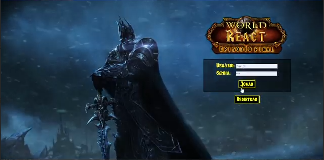
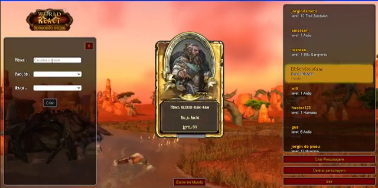
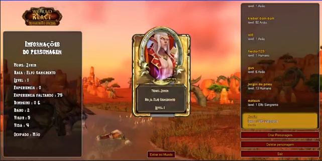
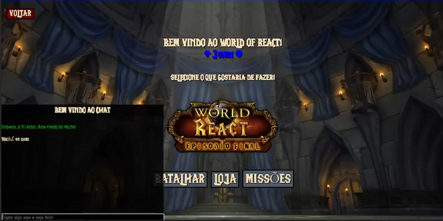
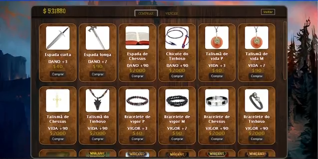
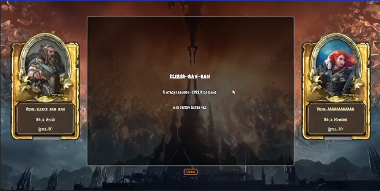
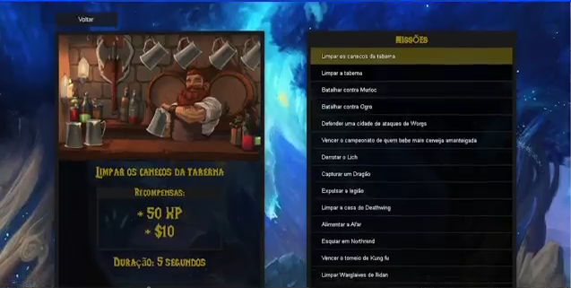

## Projeto feito em grupo

- [Gabriele Peschke Baum](https://www.linkedin.com/in/gabriele-peschke-baum-7aa065198/)
- [Pedro Henrique Scaravonatto Zanardi](https://www.linkedin.com/in/pedro-henrique-scaravonatto-zanardi-774373184/)
- [Héctor Tavares da silva](https://www.linkedin.com/in/hector-tavares/)

Projeto com temática de World of Warcraft com intuito de colocar em pratica os assuntos e téncologias aprendidada, onde tinhamos funcionalidades como:

- Autenticação
    
- Seleção e Criação de personagem
    
    
- Chat
    
- Loja
    
- Batalha
    
- Missões
    
